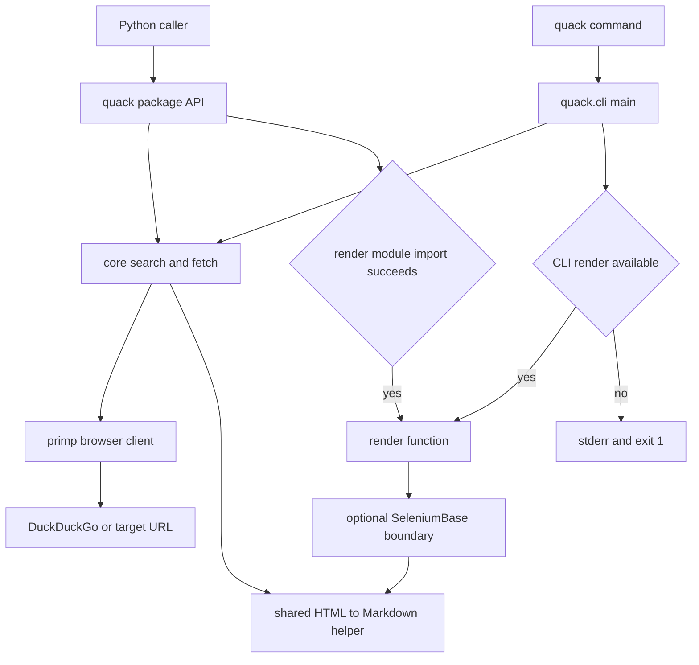

## Boundary at a glance

Quack has a deliberately small default runtime: the installed package depends on `primp`, `selectolax`, and `html2text`, while the browser automation stack is isolated behind the `render` extra. The supported invocation surfaces are the Python package and the `quack` console script; both ultimately use the core search/fetch functions, but the CLI owns argument parsing, formatting, file output, and process exit behavior.



*The default transport is separate from the optional SeleniumBase renderer; package export selection and CLI command availability are independently evaluated.*

## Package API and import contract

`quack/__init__.py` is the package façade. It re-exports `search`, `fetch`, `main`, the public `LibraryError` hierarchy, and the query/result helpers `validate_query`, `clean_query`, and `filter_results`. `__all__` defines this base star-import surface, so these names—not the internal parser and transport helpers—are the compatibility-sensitive package API. `__version__` is also set in the package, although it is not part of `__all__`.

The render names are conditional. At package initialization, `quack` attempts `from .render import render, RenderError`; only a successful import sets `_render_available` and appends those names to `__all__`. Therefore, **render export availability is decided by import success**, not by metadata inspection or an explicit feature flag. This is intentionally a soft boundary for the optional module, but it means changes to imports at the top of `quack/render.py` can alter what `from quack import *` exposes.

Do not equate that import-time decision with a usable browser renderer. SeleniumBase is imported lazily inside `render()`, so the render module itself can import even when SeleniumBase is absent; calling `render()` then raises `RenderError` with installation guidance. The CLI performs its **own, separate** guarded import into `RENDER_AVAILABLE`; it does not consume the package-level `_render_available` flag. Preserve both checks if package and command behavior must remain independently safe.

### Public callable domains

| Domain | Public entry point | Role and key boundary |
| --- | --- | --- |
| Search | `search(query, max_results=10, timeout=30, max_retries=3)` | Queries DuckDuckGo's HTML endpoint through an impersonating `primp` client and returns cleaned result dictionaries. It accepts at most 10 results. |
| Fetch | `fetch(url, timeout=30, max_retries=3)` | Retrieves an HTTP(S) page through the same client and returns Markdown rather than raw HTML. |
| Rendering | `render(url, wait_time=2)` | Optional JavaScript-capable path. It accepts HTTP(S) and `file://` URLs, drives SeleniumBase UC Mode, then returns Markdown. |
| Helpers | `validate_query`, `clean_query`, `filter_results` | Pure, separately importable query/result utilities; they do not configure or invoke the network client. |
| Command | `main()` / `quack` | CLI adapter over search, fetch, and optional render; it owns presentation and exit semantics. |

The error hierarchy is part of the usable API: `LibraryError` is the common base; search failures derive from `SearchError` (`NoResultsError`, `ChallengeError`, `SearchRequestError`), and fetch failures derive from `FetchError` (`FetchRequestError`). `RenderError` derives directly from `LibraryError`. Callers that want Quack-originated operational errors can catch `LibraryError`, while retaining more specific handling where needed. Invalid arguments remain `ValueError` rather than library errors.

## Core transport and conversion seam

`search()` and `fetch()` each create a fresh `primp.Client` through `_create_browser_client()`. The client impersonates Safari on macOS and uses HTTP/2-only requests. This client factory is the shared transport policy seam: changing it changes both non-rendering operations, whereas the SeleniumBase renderer is independent.

For transient `primp.ConnectError` and `primp.TimeoutError`, search and fetch retry the initial attempt plus `max_retries` additional attempts, with exponential delays of `1`, `2`, `4`, ... seconds capped at `10`. At exhaustion they translate the failure to their operation-specific request error and retain the original exception as the cause. Status errors are translated immediately. Search additionally detects known bot-challenge signals and raises `ChallengeError` without retrying; it parses the DuckDuckGo HTML response, cleans valid results, and raises `NoResultsError` when none survive.

`_html_to_markdown()` is a private but architectural shared seam: it configures `html2text` to leave lines unwrapped and preserve links, images, and emphasis. Both `fetch()` and `render()` pass their acquired HTML through this exact helper. Keep it shared when changing output conversion so static and JavaScript-rendered retrieval do not silently diverge.

## Console entry point and operational behavior

Packaging registers `quack = "quack.cli:main"`. `main()` requires one of three subcommands:

- `quack search QUERY [--max N] [--json] [--timeout SECONDS]` joins all positional query tokens with spaces, delegates to `search`, and prints either indented UTF-8 JSON or numbered human-readable results.
- `quack fetch URL [--timeout SECONDS] [--output PATH]` delegates to `fetch`; without `--output` it writes Markdown to standard output, otherwise it overwrites `PATH` as UTF-8 and prints a confirmation.
- `quack render URL [--wait-time SECONDS] [--output PATH]` first checks the CLI's separate `RENDER_AVAILABLE` value. If unavailable, it writes an installation error to standard error and exits with status 1. If available, it follows the fetch output pattern but calls `render` without a timeout option.

The adapter maps `ValueError`, any `LibraryError`, and any other exception to diagnostic standard error output and `sys.exit(1)`. Consequently, library consumers receive exceptions, while command users receive a stable nonzero process outcome. Argument-parser errors and `--help`/`--version` use argparse's own exit behavior; the version is read from installed package metadata rather than importing `quack.__version__`, which avoids a CLI/package circular import.

## Optional rendering lifecycle

`render()` validates its URL before attempting the optional SeleniumBase import. Once available, it opens a short-lived `SB` context configured for UC mode, `headless2`, incognito, and `en-GB`; it opens the URL through `uc_open_with_reconnect`, waits `wait_time`, optionally attempts a CAPTCHA click, captures the rendered page source, and converts it through `_html_to_markdown()`. The context manager bounds browser-session lifetime. Failures after the SeleniumBase import—including browser and conversion errors—are wrapped as `RenderError`; the CAPTCHA-click attempt alone is deliberately best-effort and does not fail the request.

Operationally, install rendering only where it is needed:

```bash
uv tool install "git+https://github.com/corvuslee/quack.git[render]"
```

The `render` extra brings `seleniumbase` and its browser-related dependencies, while the normal installation avoids that heavier runtime. Treat browser availability and driver setup as deployment concerns of the optional domain, not requirements of search or fetch.

## Change and test guide

- **Preserve the façade.** Add or remove package exports deliberately, update `__all__` consistently, and keep optional imports guarded. A top-level SeleniumBase import would change the package's conditional-export behavior and undermine the lightweight install.
- **Preserve the conversion seam.** Changes to Markdown settings belong in `_html_to_markdown()` and should be assessed for both fetch and render output.
- **Keep CLI and library contracts distinct.** Library functions should continue to expose typed errors; CLI changes must retain stderr versus stdout routing, output-file behavior, and status-1 failure behavior.
- **Test at the correct boundary.** `tests/test_core.py` covers validation, retry/backoff, challenge handling, error translation, and conversion in mocked transport paths. `tests/test_cli.py` verifies argument-to-call mapping, output formatting/files, and error exits. `tests/test_render.py` conditionally exercises a local `file://` fixture so JavaScript execution is checked when SeleniumBase is installed. The integration search test exercises the package-level `search` import and the live DuckDuckGo response shape.

For the detailed request and output semantics, see [content retrieval](../workflows/content-retrieval.md), [search pipeline](../workflows/search-pipeline.md), and [failure and output contracts](../concepts/failure-and-output-contracts.md).
