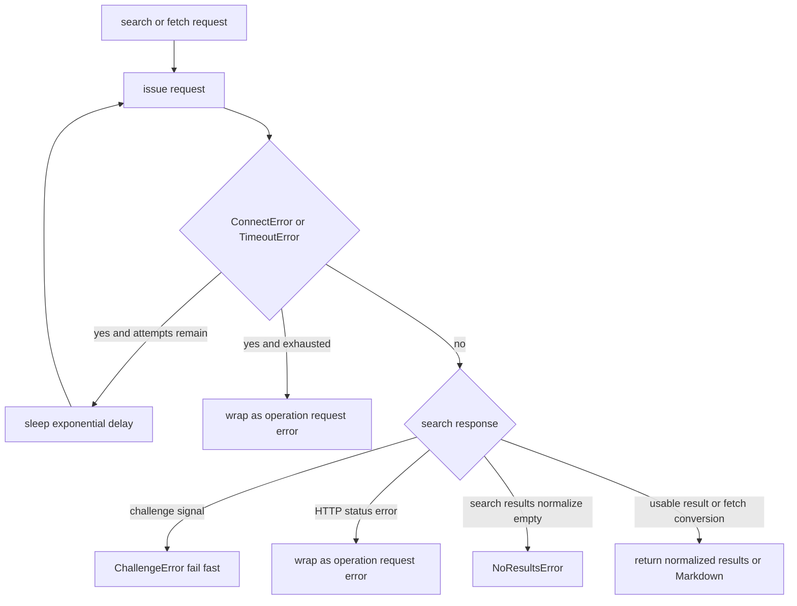

## Contract boundary

Quack deliberately exposes two layers of failure behavior. Python callers invoke `search()`, `fetch()`, or optional `render()` and receive validation errors or typed library exceptions. The `quack` command is an adapter: after argparse has parsed a subcommand, it turns those failures—and failures in its own output work—into a diagnostic on standard error and a status-1 process exit. Do not make library functions print or exit; do not make the CLI silently absorb errors.

`LibraryError` is the common operational-error base. Search-specific errors derive through `SearchError` (`NoResultsError`, `ChallengeError`, and `SearchRequestError`); `FetchRequestError` derives through `FetchError`; and `RenderError` derives directly from `LibraryError`. This lets an API consumer catch either a precise condition or all Quack-originated operational failures, while retaining `ValueError` as the distinct signal for invalid arguments.

| Entry point | Accepted input contract | Success output | Intended failure surface |
| --- | --- | --- | --- |
| `search(query, max_results=10, timeout=30, max_retries=3)` | `query` must be a non-empty `str`; `max_results` must be an integer from 1 through 10; `max_retries` must be a non-negative integer | A non-empty list of normalized `{title, href, body}` dictionaries | `ValueError`, `ChallengeError`, `NoResultsError`, or `SearchRequestError`; unexpected failures generally propagate |
| `fetch(url, timeout=30, max_retries=3)` | A non-empty `str` which, after stripping, begins `http://` or `https://`; non-negative integer retries | Markdown converted from the response HTML | `ValueError` or `FetchRequestError`; unexpected failures generally propagate |
| `render(url, wait_time=2)` | A non-empty `str` which, after stripping, begins `http://`, `https://`, or `file://` | Markdown converted from browser-rendered HTML | `ValueError` before setup, otherwise `RenderError` |
| `filter_results(results, min_title_length=3)` | A sequence of mapping-like result records | A new list of selected records | Pure utility: it does not call the search service or retry transport errors |

`timeout` and `wait_time` are passed to their underlying clients without validation in these entry points. Callers that require stricter ranges must enforce them themselves. `search()` also does not strip the query: a whitespace-only string passes its direct non-empty-string check, unlike `validate_query()`.

## Validation is local, and helpers are not a preprocessing pipeline

The public utilities are useful to callers, but are not invoked by `search()`. `validate_query()` returns a boolean and rejects blank-after-strip, non-string values; `clean_query()` returns `""` for a falsey input and otherwise strips and collapses whitespace. Neither utility raises errors or changes the arguments passed by the CLI to `search()`.

The CLI joins the one-or-more `search` positional tokens with spaces, parses `--max` and `--timeout` as integers, and calls `search(query, max_results=args.max, timeout=args.timeout)`. It does **not** expose `max_retries`, so command users use the core default of three additional retries. Parsing itself occurs before the CLI error-handling `try` block: missing commands, invalid option syntax, `--help`, and `--version` retain argparse’s own output and exit behavior.

## Search normalization versus `filter_results`

There are two intentionally separate result policies. They must not be conflated or casually substituted for one another.

### Internal search normalization

After parsing DuckDuckGo HTML, `search()` examines at most the first `max_results` `div.result.web-result` elements. Per element it extracts the title link and optional snippet, decodes a DuckDuckGo redirect URL when applicable, and calls private `_clean_result()`. A record is discarded if its title or href is falsey. Otherwise title and body are stripped and whitespace-collapsed; a href not starting with `http://` or `https://` is converted by prefixing `https://` after leading slashes are removed. Thus internal normalization may retain a short title and may turn a relative or scheme-less href into an HTTPS-prefixed string. Individual extraction or cleaning exceptions are swallowed and skip only that result. If none survive, `search()` raises `NoResultsError`.

### Exported standalone filter

`filter_results()` is a separately exported, pure post-processing utility. It neither normalizes whitespace nor decodes redirects nor constructs URLs. It preserves accepted title and href values verbatim, supplies `""` when `body` is absent or `None`, and requires both an HTTP(S)-prefixed href **already present** and a stripped title with length at least `min_title_length` (default 3). It only filters records supplied by its caller and is not on the `search()` call path. Applying it after search can therefore remove results that search itself legitimately returned; replacing `_clean_result()` with it would change search output semantics.

## Transport failures, retry policy, and classification

`search()` and `fetch()` each create one fresh browser-impersonating client and execute an initial request plus up to `max_retries` more attempts. Only `primp.ConnectError` and `primp.TimeoutError` are transient: before another attempt they sleep `min(2 ** attempt, 10)` seconds, giving 1, 2, 4, … seconds capped at 10. Once retries are exhausted, the operation translates the original failure to `SearchRequestError` or `FetchRequestError` and chains it as the cause. `primp.StatusError` is translated immediately and is not retried.

Search adds fail-fast response classification before parsing: a status of 202, `anomaly.js` or `challenge-form` in body/URL, or a form action containing `cc=botnet` is a `ChallengeError`. It is re-raised immediately—no sleep and no second request. Search also explicitly turns an integer HTTP status of 400 or higher into `SearchRequestError` before calling `raise_for_status()`. An empty set after its own normalization is a semantic `NoResultsError`, not a retryable transport failure.

*Only connection and timeout failures retry; search challenges, status failures, and no-result outcomes do not.*

The wrapping boundary is deliberately narrow. In `fetch()`, an arbitrary error from the client or HTML-to-Markdown conversion is not caught by the network-specific handlers and propagates unchanged; this includes a `ValueError` raised by a mocked or downstream client. Search likewise propagates unexpected outer-loop errors, although its per-result `except Exception` protects the overall search from malformed individual result elements. In contrast, after `render()` has validated input and imported SeleniumBase, its broad handler wraps browser, conversion, and other rendering-path failures in `RenderError`; only the optional CAPTCHA click is best-effort and ignored on failure. A missing lazy SeleniumBase import is also reported as `RenderError` with installation guidance.

## Process-level presentation and output invariants

For a successfully executed command, stdout is reserved for results and confirmation:

- `quack search` emits indented JSON with `ensure_ascii=False` under `--json`; otherwise it emits numbered records, URL on the next indented line, and body only when non-empty.
- `quack fetch` and `quack render` print Markdown unless `--output PATH` is supplied. With a path, the CLI overwrites it using UTF-8, then prints `Content saved to PATH`.
- `quack render` first checks its CLI-local optional import. If unavailable, it prints dependency-install guidance to stderr and exits 1 without calling `render()`.

Every exception raised within the dispatch/output `try` follows one of three visible error templates, all to stderr followed by `sys.exit(1)`:

| Exception category | stderr form |
| --- | --- |
| `ValueError` | `Invalid input: MESSAGE` |
| `LibraryError` (including all typed search, fetch, and render errors) | `CLASSNAME: MESSAGE` |
| Any other `Exception`, including a file-write error | `Unexpected error: MESSAGE` |

This ordering matters: `ValueError` is presented as invalid input even when it originated unexpectedly downstream, while subclasses of `LibraryError` preserve their concrete class name. The CLI’s generic branch is a presentation safety net, not a replacement for the library’s typed exception taxonomy.

## Change and verification guide

Preserve the distinction between validation, normalization, and post-filtering when extending a command or result schema. In particular, test a core change at the behavior it owns rather than relying solely on the CLI:

- `tests/test_core.py` verifies direct invalid-input errors, retry count/backoff and chained exhaustion errors, no-results, challenge fail-fast behavior, internal result cleaning, and propagation of an unexpected fetch error.
- `tests/test_utils.py` verifies the independent query helpers and `filter_results()` title-length, scheme, `None`, and preservation behavior. Its coverage is evidence that the utility is a caller-directed filter rather than core search logic.
- `tests/test_cli.py` verifies argument delegation, JSON/text output, file output, exact error text, stderr routing, and exit code 1. Add CLI tests whenever presentation or exception conversion changes.
- `tests/test_render.py` conditionally runs a local `file://` fixture and checks that JavaScript-modified content is returned, as well as render URL validation.

See [Runtime Domains and Public Surface](../architecture/public-surface.md) for package/export and optional-dependency boundaries, and [content retrieval](../workflows/content-retrieval.md) and [search pipeline](../workflows/search-pipeline.md) for the end-to-end workflows when those pages are available.
