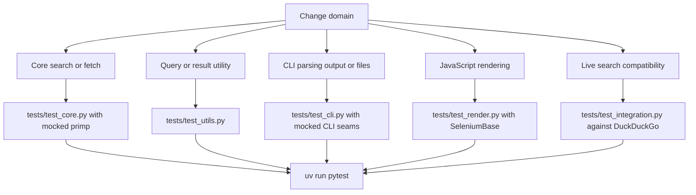

## Verification boundary

Quack’s verification strategy has deliberately different layers. Most behavior is tested without making network requests or starting a browser: unit tests invoke core helpers and public functions with controlled `primp` clients, while CLI tests replace the imported `search` and `fetch` call seams and inspect process-facing output. These tests should establish deterministic contracts for parsing, retries, conversion, argument delegation, error presentation, and file output.

Two tests intentionally cross an external boundary:

* `tests/test_integration.py` calls `search("quantum computing entanglement protocols")` against DuckDuckGo. It requires a non-empty result set whose records have `href`, `title`, and `body`, and it rejects DuckDuckGo redirect URLs. It is an integration signal for the live search endpoint and its current markup—not a hermetic unit test.
* `tests/test_render.py` opens a local `file://` fixture through the optional SeleniumBase renderer. It verifies an actual JavaScript state transition rather than merely asserting that static HTML can be converted.

The ordinary `pytest` command collects both; there is no marker or configuration in the repository which isolates the live test. Treat network availability, DuckDuckGo behavior, browser/driver availability, and optional dependency installation as operational preconditions when running the complete suite.



*Select the focused test file for the behavior being changed, then run the complete suite when the change is ready for delivery.*

## Focused test selection

Start with the smallest relevant command; it gives faster and more actionable feedback than relying on an unrelated end-to-end path:

| Change | Focused verification | What it protects |
| --- | --- | --- |
| DuckDuckGo parsing, redirect cleaning, input validation, retries, exception classification, or HTML-to-Markdown fetch behavior | `uv run pytest tests/test_core.py` | Core public behavior and its transport/error invariants without live traffic |
| `validate_query()`, `clean_query()`, or `filter_results()` | `uv run pytest tests/test_utils.py` | The independent utility contracts, including whitespace and accepted URL/title policy |
| argparse options, command-to-library delegation, stdout/stderr, exit status, JSON/text format, or `--output` writes | `uv run pytest tests/test_cli.py` | The command adapter rather than the transport implementation |
| renderer validation or rendered-content handling | `uv run pytest tests/test_render.py` | The browser-backed optional feature; see the dependency requirements below |
| compatibility with the real search service or its result HTML | `uv run pytest tests/test_integration.py` | Live search results and cleaned result URL shape; expect external flakiness |

After focused checks, run `uv run pytest` to reproduce CI’s test command. A change to packaging, lock resolution, lint-sensitive files, or release metadata also needs the CI-equivalent checks described in [Delivery gates](#delivery-gates).

### Mocked core boundary

`search()` and `fetch()` each obtain their transport from `_create_browser_client()`, which constructs `primp.Client`. Core tests patch `quack.core.primp.Client` at that lookup boundary, give the fake client controlled `.get()` outcomes, and, for retry timing, patch `quack.core.time.sleep`. The tests therefore prove request parameters, retry count, exponential backoff, typed wrapping with the original `primp` error as the cause, no-result behavior, and challenge fail-fast behavior without contacting DuckDuckGo.

This seam matters for safe changes: mock `quack.core.primp.Client`, not a separate `primp.Client` reference, because the production module resolves the constructor through `quack.core`. Use realistic response doubles with `.text` and `.raise_for_status()` where parsing or status handling is under test. Reserve the integration test for validating assumptions that a double cannot establish, such as the search service’s currently served result structure.

### Mocked CLI boundary

The CLI imports `search` and `fetch` into `quack.cli`, so CLI tests patch `quack.cli.search` or `quack.cli.fetch`, set `sys.argv`, and use `capsys` to inspect output. The output-file test additionally patches `builtins.open`. This keeps command tests focused on joining query tokens, forwarding defaults or command-line overrides, selecting output format, UTF-8 file writing, and mapping raised exceptions to stderr plus status 1; it avoids duplicate testing of core HTTP behavior.

When adding a CLI path, test both delegation and the visible process contract. A core unit test alone cannot prove that an option is parsed, a typed exception has the intended presentation, or a file destination is used correctly. Conversely, do not use a CLI test as the only evidence for retry or parser behavior when `tests/test_core.py` can target it directly. For error and output semantics, see [Input, Failure, and Output Contracts](../concepts/failure-and-output-contracts.md).

## Optional rendering is a separate capability

The core project dependencies are `html2text`, `primp`, and `selectolax`. SeleniumBase belongs exclusively to the `render` optional extra, so normal search and fetch use neither a browser dependency nor browser startup. The CLI and package both try to import rendering separately and preserve core availability if that import fails; invoking `render()` without SeleniumBase produces `RenderError` with installation guidance, while the CLI detects its unavailable import before dispatching the command.

Install the renderer when its behavior must be exercised:

```bash
uv sync --extra render --dev
uv run pytest tests/test_render.py
```

The render test itself catches an `ImportError` while importing `quack.render` and skips in that case. With SeleniumBase installed, it is a real browser test, not a mock: `render()` creates an `SB` session in UC mode, opens the supplied URL, waits, retrieves browser page source, and converts it to Markdown. Failures after that import—including browser setup or rendering failures—are not skipped by the test.

### Local JavaScript fixture

`tests/fixtures/js_test.html` begins with status and body text that say JavaScript has not executed. Its inline script replaces both strings. The test builds an absolute `file://` URL for that fixture, renders it with `wait_time=2`, asserts the replacement strings are present, and asserts the static originals are absent. This makes the test independent of a remote page while still proving that JavaScript executed and that the renderer returned the post-script document.

Keep this fixture minimal and deterministic. If changing renderer lifecycle or HTML-to-Markdown behavior, preserve the before/after assertion pattern—or replace it with another fixture that makes the rendered state observably different from source HTML. A static fixture that yields the same content before and after script execution would not validate the feature.

## Delivery gates

The GitHub Actions `CI` workflow runs for pushes and pull requests targeting `main` on `ubuntu-latest`. It reads the interpreter version from `.python-version`, installs a pinned uv action/version with caching, and then runs the following ordered gates:

1. `uv sync --locked --all-extras --dev` resolves exactly from `uv.lock` and installs development dependencies plus every optional extra. Consequently, CI intentionally installs SeleniumBase and exercises the render-capable dependency set rather than treating it as a core install.
2. `uv run ruff check .` rejects lint violations, followed by `uv run ruff format --check .`, which rejects formatting drift.
3. `uv run pytest` runs the repository test suite, including the live DuckDuckGo integration test and, when its browser environment is viable, the SeleniumBase render test.
4. `uv build` produces distributable artifacts, and `actions/upload-artifact` publishes `dist/` as the `dist` artifact.

The locked sync is a release-quality guard as well as an installation step: dependency edits must be accompanied by a lockfile state that uv accepts. The build happens only after quality and test gates succeed, so an uploaded `dist` artifact represents a package that passed the configured lint, formatting, and test sequence. It is a CI artifact, not evidence that the package has been published.

## Change checklist

1. Identify whether the change is core, utility, CLI, optional render, live-search compatibility, or packaging. Add or update the narrow test at the owning boundary.
2. Use mocks for `primp` and CLI dispatch/output to make behavioral tests deterministic. Do not convert the integration test into the sole proof of a core contract.
3. For rendering changes, install the `render` extra and run the fixture-based test. Do not make SeleniumBase a required dependency merely to test search or fetch.
4. Run `uv run pytest` before delivery, recognizing its external search and browser requirements.
5. Before merging, ensure the locked all-extras development environment, both Ruff checks, test suite, and `uv build` succeed—the same quality path CI enforces.

For package entry points and optional-export behavior, see [Runtime Domains and Public Surface](../architecture/public-surface.md).
