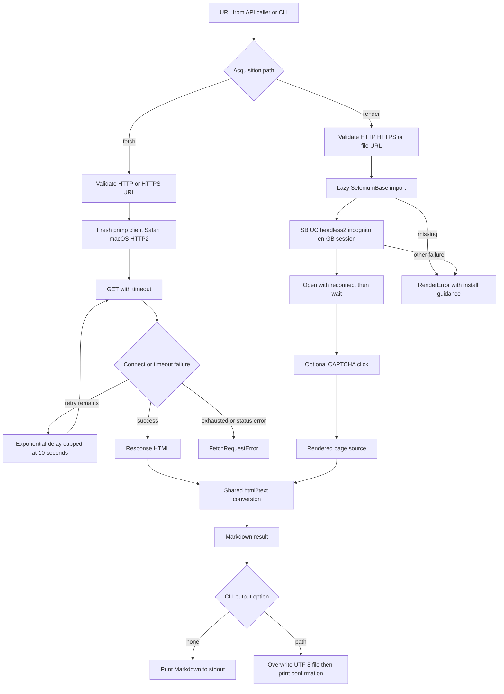

## Choosing an acquisition path

Quack has two paths that both return Markdown rather than HTML, but they acquire the document in fundamentally different ways:

| Need | Library entry point | Accepted URL schemes | Acquisition boundary | Runtime requirement |
| --- | --- | --- | --- | --- |
| The response HTML is sufficient | `fetch(url, timeout=30, max_retries=3)` | `http://`, `https://` | A `primp` HTTP client impersonating Safari on macOS and restricted to HTTP/2 | Core dependencies only |
| The browser's post-JavaScript DOM is required, or a local fixture must be opened | `render(url, wait_time=2)` | `http://`, `https://`, `file://` | A short-lived SeleniumBase UC browser session | The optional `render` extra, which supplies SeleniumBase |

Use `fetch()` by default: it does not run page JavaScript and has the smaller dependency and operational footprint. Use `render()` only where the source HTML does not contain the required content or where browser execution is the point of the operation. `file://` is deliberately a renderer-only capability; it is not a general local-file fetch path.



*Fetch uses a retrying impersonated HTTP client; render uses one bounded browser session and optional CAPTCHA interaction. Both converge at the same conversion helper and CLI sink policy.*

## Static fetch: transport, retry, and boundary

`fetch()` first requires a non-empty string, strips it, and accepts only values starting with `http://` or `https://`; it also rejects a negative or non-integer `max_retries`. It creates a new client for the operation through `_create_browser_client()`, so the shared client configuration is a transport-policy seam used by both search and fetch—not by SeleniumBase rendering.

The function calls `browser.get(url, timeout=timeout)` and `raise_for_status()`, then passes `response.text` to the converter. A connection or timeout error gets an initial attempt plus up to `max_retries` additional attempts. Before each remaining retry it sleeps `min(2 ** attempt, 10)` seconds, producing 1, 2, 4, … seconds with a 10-second cap. Exhaustion becomes `FetchRequestError` with the original `primp` exception chained as its cause; a `primp.StatusError` is immediately translated to `FetchRequestError`. Other exceptions—including failures from conversion—are not caught by these narrow handlers and propagate unchanged.

This makes `timeout` a client option rather than a whole-workflow deadline. The CLI exposes it as `quack fetch URL [--timeout SECONDS]`; callers using the library can also select retry count, while the CLI relies on the library default of three additional retries. See [Input, Failure, and Output Contracts](../concepts/failure-and-output-contracts.md) for the common exception/presentation boundary.

## JavaScript rendering: dependency and session lifecycle

`render()` performs URL validation **before** importing SeleniumBase. It then lazily imports `SB`; an unavailable dependency raises `RenderError` directing the user to install the optional render dependencies. Packaging keeps `seleniumbase` in the `render` optional extra, rather than imposing browser automation on normal fetch/search installations:

```bash
uv tool install "git+https://github.com/corvuslee/quack.git[render]"
```

When the dependency is available, `render()` enters `with SB(uc=True, headless2=True, incognito=True, locale="en-GB") as sb:`. The context owns a fresh, bounded browser session; incognito supplies a clean session, and the context manager closes it when the block exits. The renderer opens the URL with `sb.uc_open_with_reconnect(url)`, sleeps for the caller-provided `wait_time` after loading, and then tries `sb.uc_gui_click_captcha()`. CAPTCHA interaction is best effort: any exception from that click is ignored, while the remaining page source is still collected.

Next, `sb.get_page_source()` supplies the post-execution document. Failures after the SeleniumBase import—browser startup, opening, waiting, source retrieval, or conversion—are caught by the outer handler and re-raised as `RenderError`. In contrast to `fetch()`, this path has no explicit timeout or retry-count parameter; its anti-bot opening behavior is delegated to SeleniumBase's UC reconnect method, and its only exposed pacing control is `wait_time` (default `2`).

The CLI command is `quack render URL [--wait-time SECONDS] [--output PATH]`. It has an independent guarded import made during CLI module loading. If that import were unavailable, it prints render-install guidance to stderr and exits 1 before calling `render()`. This check is separate from the renderer's lazy import, so command availability and actual SeleniumBase availability are distinct operational boundaries. More package-surface context is available in [Runtime Domains and Public Surface](../architecture/public-surface.md).

## One HTML-to-Markdown contract

The private `_html_to_markdown()` helper is the intentional convergence point for the two workflows. It constructs `html2text.HTML2Text()` with `body_width = 0`, `ignore_links = False`, `ignore_images = False`, and `ignore_emphasis = False`, then calls `handle(html_content)`. Thus neither workflow wraps output lines, and both preserve links, images, and emphasis according to the same converter configuration.

Keep conversion changes in this helper, not in only one acquisition path. A fetch result represents the server response HTML; a render result represents the browser's current page source after the wait and optional CAPTCHA attempt. Their document state differs, but their Markdown formatting contract must not silently diverge.

## CLI delivery behavior

Both retrieval commands use the same output adapter after a successful library call:

- Without `--output`/`-o`, `quack fetch` or `quack render` prints the Markdown string to stdout.
- With `--output PATH`, the CLI opens `PATH` in write mode with `encoding="utf-8"`, overwriting the file, writes the Markdown, and prints `Content saved to PATH` to stdout. The Markdown itself is therefore in the file, not duplicated to stdout.
- `ValueError`, a `LibraryError` subclass such as `FetchRequestError` or `RenderError`, and any other exception occurring during dispatch or output are diagnosed on stderr and exit with status 1. In particular, a file-write failure follows the generic `Unexpected error: ...` branch.

This separation is useful in scripts: choose stdout for pipelines, or an output file for persisted content while retaining a concise success acknowledgement. Do not infer that an output filename controls content format—the stored value is the same Markdown returned by the chosen library function.

## Focused verification and safe changes

The core tests mock `quack.core.primp.Client` and demonstrate the fetch contract without network traffic: URL/retry validation, successful HTML-to-Markdown conversion, request timeout forwarding, one-second first backoff, exhaustion after initial-plus-retry attempts, immediate status translation, and propagation of an unexpected error. Update these tests if changing client setup, retry classification, or conversion ownership.

`tests/test_render.py` is deliberately browser-backed and conditional on the optional environment. It renders `tests/fixtures/js_test.html` through an absolute `file://` URL. The fixture begins with static strings claiming JavaScript did not execute, while its inline script replaces them; the test asserts the replacements appear and the originals do not. That verifies both browser execution and post-render page-source conversion, rather than merely proving that static HTML can be converted. Run the focused checks appropriate to the changed boundary:

```bash
uv run pytest tests/test_core.py
uv sync --extra render --dev
uv run pytest tests/test_render.py
uv run pytest tests/test_cli.py
```

CLI tests directly cover fetch argument forwarding, stdout output, UTF-8 `--output` writing, confirmation text, and error presentation. There are no render-specific CLI tests in the current suite, so changes to render command parsing or its output path should add command-level coverage in addition to the browser test. For full test/CI operating guidance, see [Verification, Optional Dependencies, and Release Checks](../testing/verification-and-delivery.md).
