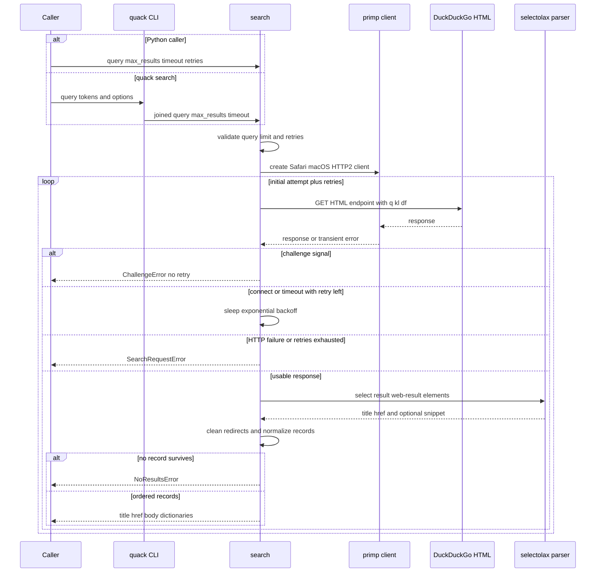

## Scope and entry points

The search workflow is a lightweight, HTML-based DuckDuckGo integration, not a browser-rendering workflow and not a general result-ranking layer. Its public library entry point is `search(query, max_results=10, timeout=30, max_retries=3)`, re-exported from `quack`. It returns a non-empty list of dictionaries with exactly the normalized fields `title`, `href`, and `body`, or raises a search-specific error. The independent `fetch()` and optional `render()` paths retrieve page content after a caller has a URL; they are not part of search result acquisition. See [content retrieval](content-retrieval.md) for those workflows.

The console route is `quack search QUERY [--max N] [--json] [--timeout SECONDS]`. `argparse` accepts one or more query tokens, which the CLI joins with spaces, then delegates to `search(query, max_results=args.max, timeout=args.timeout)`. The command does not expose `max_retries`, so it uses the library default of three additional attempts. On success it either prints indented JSON with Unicode retained (`--json`) or numbered text records; text output prints `title`, then `href`, and only prints `body` when it is non-empty. Library callers receive exceptions; the CLI presents `ValueError` and `LibraryError` failures on standard error and exits 1.

## Lifecycle



*The sequence shows the search-specific response classification and parsing path; only connection and timeout failures enter the retry loop.*

### Validate, construct, and request

`search()` rejects a query that is not a non-empty `str`, a `max_results` value that is not an integer from 1 through 10, and a negative or non-integer retry count. It does not strip the query, so a whitespace-only string satisfies this particular non-empty check. The maximum of ten is both input policy and parser behavior: after parsing, the implementation examines only the first `max_results` provider result containers. Consequently, a request can return fewer than its requested limit when candidates in that first slice are malformed or filtered; it does not continue into later provider results to fill the limit.

For each call, the pipeline creates a fresh `primp.Client` configured as Safari on macOS with `http2_only=True`. It sends `GET` to `https://html.duckduckgo.com/html/` with URL-encoded parameters `q` for the supplied query, `kl=uk-en`, and an empty `df` (no date filter), forwarding `timeout` to `browser.get`. This factory is shared with static `fetch()`, so changing impersonation or HTTP/2 policy changes both operations.

### Fail fast before parsing

Search classifies bot challenges before HTTP-status handling or result parsing. A response is a challenge if its status is `202`; if its body or URL contains `anomaly.js` or `challenge-form`; or if any parsed `form` has an `action` containing `cc=botnet`. The pipeline raises `ChallengeError` immediately. This is intentionally distinct from an empty result page and from retryable networking: a challenge does not sleep, retry, or attempt to parse ordinary results.

An integer response status of 400 or greater becomes `SearchRequestError`; remaining status failures surfaced by `response.raise_for_status()` as `primp.StatusError` are also translated to `SearchRequestError`. Neither status path retries. This response classification makes it safe for callers to treat `ChallengeError` as an anti-bot boundary rather than an availability incident.

### Parse provider markup and normalize records

The HTML parser selects result containers with `div.result.web-result`, preserving the document sequence. Within each selected container, it chooses the first link matching `a.result__a, a.result__url` for both title text and raw href, and takes the optional `a.result__snippet` text as the body. Text extraction is deep, separated by spaces, and stripped.

DuckDuckGo tracking redirects are cleaned before record normalization. A href containing `/link?` or `duckduckgo.com/l/` is passed to `_extract_clean_url()`, which looks for `uddg=...` and URL-decodes that value; without a non-empty `uddg` value it leaves the original href intact. `_clean_result()` then rejects a falsey title or href, collapses whitespace in title and body, and ensures the href starts with `http://` or `https://`. Other values are made HTTPS-prefixed after removing leading slashes. `body` is always present in each returned dictionary and is `""` when the snippet is absent.

An exception while extracting or cleaning a single container is contained to that container, which is skipped. If no valid records remain, `search()` raises `NoResultsError` rather than returning an empty list. There is no application-side sort: accepted records are appended in their DuckDuckGo document order, retaining the provider order among the inspected candidates. The project decision log explicitly records that sorting was removed because DuckDuckGo provides relevance order and additional sorting would add complexity.

## Retry and failure semantics

The attempt loop performs one initial request plus up to `max_retries` additional requests. Only `primp.ConnectError` and `primp.TimeoutError` qualify for retry. Before a remaining retry after attempt number `n`, it sleeps `min((2**n) * 1.0, 10.0)` seconds: 1, 2, 4, and so on, capped at 10 seconds. On exhaustion, it raises `SearchRequestError` and chains the original transient exception as its cause. `NoResultsError` and `ChallengeError` are explicitly re-raised; status errors are translated immediately; unexpected outer-loop exceptions are not broadly wrapped.

This narrow eligibility is an operational invariant: retries are for transient transport unavailability, not a new search strategy. In particular, increasing `max_retries` cannot bypass a challenge, recover semantic absence of valid records, or retry an HTTP status failure. `timeout` is per `browser.get` call, not a validated whole-pipeline deadline, so total elapsed time may include request attempts and backoff.

## Result and ordering contract

A successful return is a list in provider document order, limited by the **input candidate slice**, not guaranteed to contain `max_results` records. Every item has this shape:

```python
{"title": "result title", "href": "https://destination.example", "body": "optional snippet or empty string"}
```

The contract intentionally cleans only the record fields required for consumption: title/body whitespace is normalized, redirects may be decoded, and non-HTTP(S) hrefs are prefixed. It does not invoke the separately exported `filter_results()` utility, which applies a different caller-directed title-length and already-HTTP(S) policy. Do not replace `_clean_result()` with that utility without intentionally changing the public search behavior. See [failure and output contracts](../concepts/failure-and-output-contracts.md) for the broader error taxonomy and CLI presentation rules.

## Change seams and focused verification

The implementation has three compatibility-sensitive seams:

1. **Transport and request parameters.** `_create_browser_client()` owns impersonation, OS, and HTTP/2 policy for search and fetch. The URL construction owns the DuckDuckGo HTML endpoint and locale/date parameters.
2. **Markup and normalization.** The container, link, and snippet selectors encode the live provider integration. A provider markup change should be addressed here along with redirect cleaning and the three-field result contract, while preserving the first-`max_results` slice and accepted-record ordering unless their behavior is deliberately revised.
3. **Failure classification.** Challenge detection must occur before normal parsing and must remain fail-fast; retry handling should stay restricted to the two transient `primp` exceptions unless product policy changes.

Use mocked core tests for deterministic behavioral changes:

```bash
uv run pytest tests/test_core.py
```

They cover input validation, redirect extraction, record cleaning, no-result classification, a transient failure followed by successful parsing, retry exhaustion with the original cause, and challenge signals that prove exactly one request and no sleep. The live integration test is deliberately complementary:

```bash
uv run pytest tests/test_integration.py
```

It calls the package-level `search()` against DuckDuckGo, requires at least one result with all three fields, and rejects retained DuckDuckGo redirect URLs. It is the relevant compatibility alarm for actual provider markup and redirect behavior, but it depends on external availability and should not replace the mocked tests. For repository-wide test and CI guidance, see [verification and delivery](../testing/verification-and-delivery.md).
